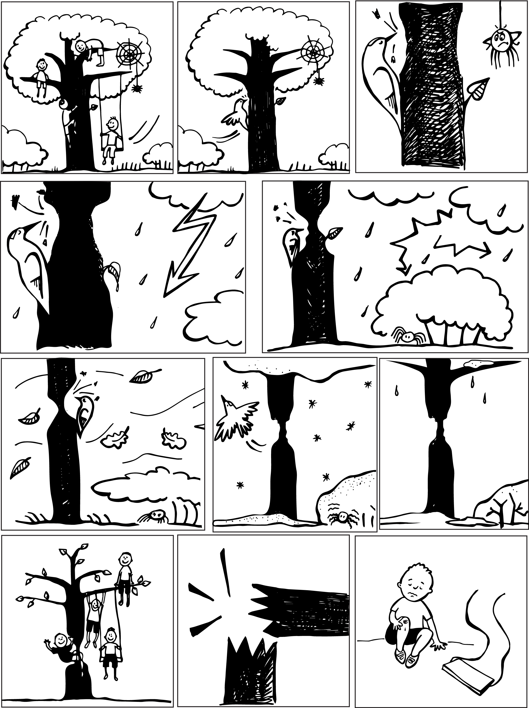
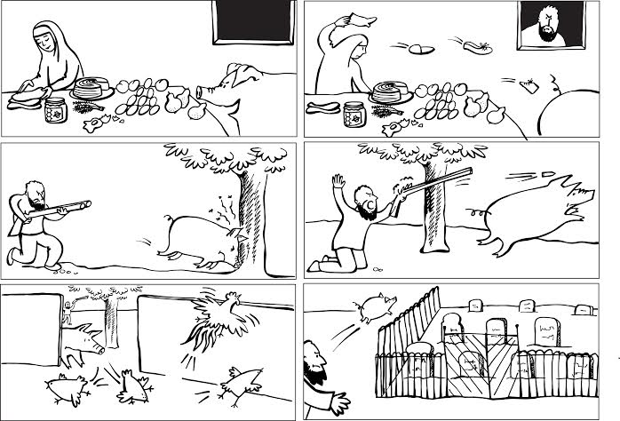

```{r setup, include=FALSE}
knitr::opts_chunk$set(echo = FALSE)
library(lingtypology)
library(dplyr)
```

## Куда мы ездили?
```{r}
df <- readxl::read_xlsx("villages.xlsx")
circassian %>% 
  filter(district == "ra") ->
  cir

df %>% 
  mutate(wow = if_else(is.na(wow), "", wow),
         sejni = if_else(is.na(sejni), "", sejni),
         opae = if_else(is.na(opae), "", opae),
         fesh = if_else(is.na(fesh), "", fesh)) ->
  df

map.feature(language = df$language,
            features = df$dialect,
            label = df$village,
            label.hide = FALSE,
            longitude = df$longitude,
            latitude = df$latitude,
            tile = "Esri.WorldGrayCanvas")
```

## Зачем мы ездили?

* существует приблизительно 157 адыгских селений в РФ
* существует приблизительно 47 в Республике Адыгея
* систематических исследований диалектологии адыгских языков не проводилось
* в результате экспедиций 20..--2018 РГГУ и НИУ ВШЭ накопилось много теоретических знаний об адыгских языках
* мы решили разработать анкету, которая позволит поймать различия, релевантные для адыгских диалектов и проверить ее в поле

## Работа в каждом селении

* **текст**: запись и звук
* анкета для **элицитации** особо сложных признаков
* **рассказ по картинкам**
* **сбор словаря**

## Текст

[база данных](https://agricolamz.github.io/multidialectal_parallel_corpus_of_adyghe/)

-- Мама, а почему мой нос маленький, а твой нос большой?

-- Ну, я выше тебя, родная, вот мой нос и больше чем твой.

-- А когда твой нос вырос?

-- Ну, когда я подросла, лет в 15 он уже был большой.

-- А где ты тогда жила? Здесь или у дедушки Заурбия?

-- В моем ауле жила, у моих родителей.

-- А теперь твой нос не растет?

-- Нет.

-- Значит, мой нос еще вырастет?

-- Да, родная

-- А если я не вырасту, то и мой нос не вырастет?

-- Чего это ты не вырастешь? Конечно, ты вырастешь.

-- Мама, коров вчера долго искали.

Куда они ушли?

-- По той улице они пошли к реке.

Там где, растут старые деревья

-- А как они их домой гнали?

-- Они свистом и криком пригоняли.

-- А я вчера перед школой видела Аслана.

Он там говорил с детьми.

А потом дал им конфет.

Два раза домой для этого заходил.

-- Да, Аслан всегда добрым был.

Раньше он работал в школе учителем.

Сейчас он старый.

-- А что он преподавал?

-- Сейчас не помню. Географию или биологию...

Однажды мы писали контрольную.

Время закончилось, а я еще писала.

Он ко мне подходит и говорит:

“Почему ты еще пишешь?

Не забывай: все нужно делать вовремя”

## Элицитация: сравнительная форма личного местоимения

```{r}
map.feature(language = df$language,
            features = df$dialect,
            label = df$sejni,
            label.hide = FALSE,
            longitude = df$longitude,
            latitude = df$latitude,
            tile = "Esri.WorldGrayCanvas")
```

## Элицитация: индексация актанта бенефактивного послелога

```{r}
map.feature(language = df$language,
            features = df$dialect,
            label = df$opae,
            label.hide = FALSE,
            longitude = df$longitude,
            latitude = df$latitude,
            tile = "Esri.WorldGrayCanvas")
```

## Элицитация: бенефактивный послелог фэш1

```{r}
map.feature(language = df$language,
            features = df$dialect,
            label = df$fesh,
            label.hide = FALSE,
            longitude = df$longitude,
            latitude = df$latitude,
            tile = "Esri.WorldGrayCanvas")
```

## Рассказ по картинкам




## Сбор словаря

* 110 слов из [Kasyan et. al. 2007]
* лексика с "интересными" рефлексами

## Wow slide

```{r}
map.feature(language = df$language,
            features = df$dialect,
            label = df$wow,
            label.hide = FALSE,
            longitude = df$longitude,
            latitude = df$latitude,
            tile = "Esri.WorldGrayCanvas")
```

## Что дальше?

* анализ данных
* чтение литературы
* поездка в другие селения
